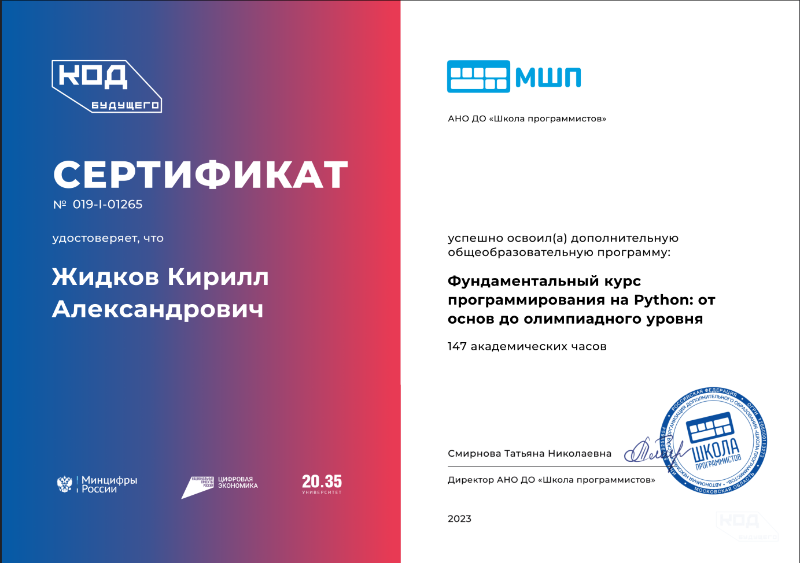
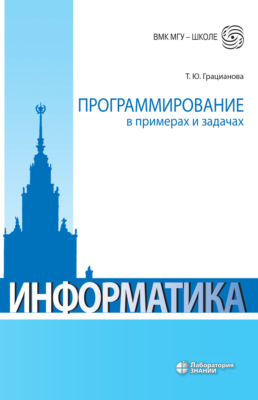
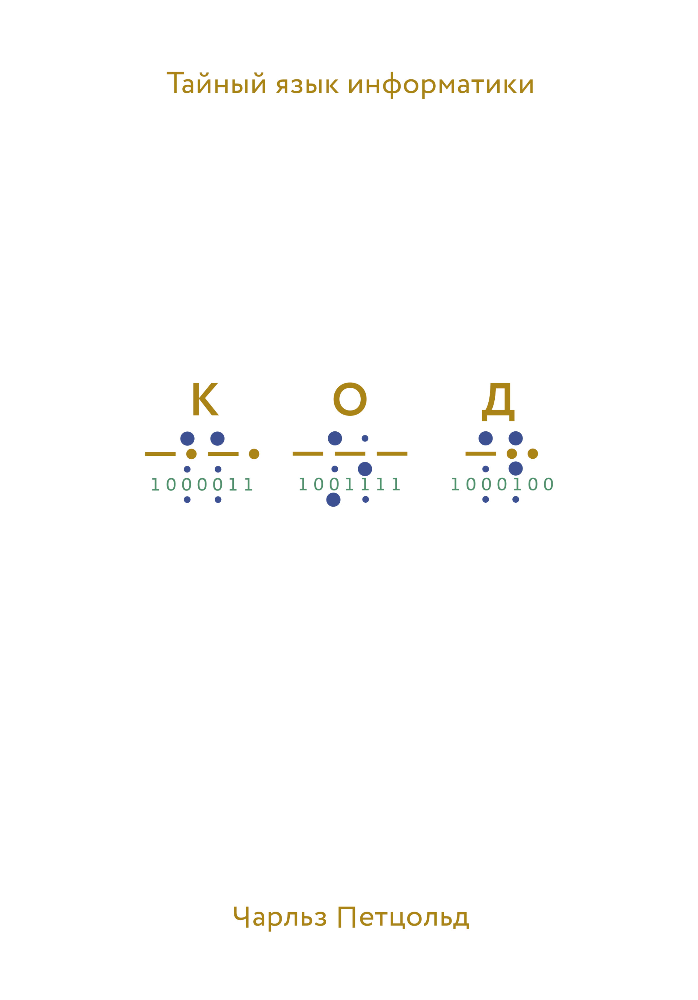
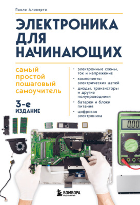

  
  
<em>Student | Learning web development and DevOps | Building portfolio → seeking opportunities </em>

---

###  My Skills

---

### 🎯 Goals

Create a **portfolio** that opens doors:  
→ to internships 🎓  
→ to open-source 🌍  
→ to first job 💼  
→ to a team where I can learn and grow 🚀

---

---

### 📬 Contact Me

- Telegram: [@bly_41R](https://t.me/bly_41R)  
- GitHub: [@Kirill20202](https://github.com/Kirill20202)  
- Write me — even if you just want to chat about code 😄

---

### Self-education

---

> 🧠 *"I don't know everything — and that's my superpower. Because I learn faster than others think."*

  
  
  

